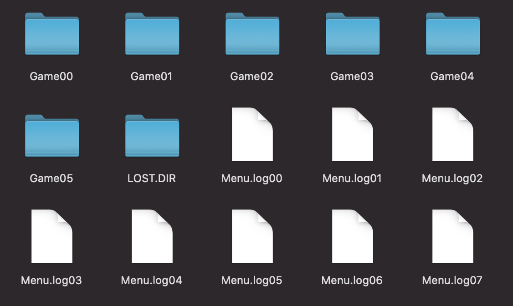

## hsk00

Add/Replace games to your "Data Frog Y2 (568 in 1)" console. This is CLI tool. Download it from releases page

🚧 **This is not ready yet** 🚧

### API

⚠️ BEFORE YOU RUN ANY COMMAND, BACKUP YOUR SD CARD ⚠️

#### `Make`

`make` command generates `hskXX.asd` and `hsk00.asd` files with custom games in it
⚠️ This won't change game menu, you still see old list. ⚠️

If you can't lanuch games or change menu page, restore files with your backup

**Example:**

```shell
hsk00 make --in in/Famicom_Wars.nes --in in/Heavy_Barrel.nes --in in/Fantasy_Zone.nes --in in/Final_Fantasy_II.nes --in in/Gauntlet_II.nes   --out hsk06.asd  --hsk00 hsk00.asd
```

This will generate new `hsk06.asd` and update `hsk00.asd`. Copy these two to `GameXX` directory. Your new games are available from number #25 to #30 (from `(06-1)*5` to `06 * 5`)

### Supported Consoles

- DATA FROG Y2 HD (568 in 1)
- Extreme Mini HD Game Box
- Probably works with SD card that looks like below



Let me know if it works with other consoles. It helps other people

### Need Help

I am not able to understand what are `GameXX.bin`, `Menu.logXX` files. They have background images, and menu selection images hidden them. But I am not able to determine offset of these images. If you know anything about these files, please let me know.

### References

- https://golangcode.com/create-zip-files-in-go/
- https://gist.github.com/madevelopers/40b269730df687cdcb8b
- https://stackoverflow.com/questions/28513486/how-add-a-file-to-an-existing-zip-file-using-golang
- http://blog.ralch.com/tutorial/golang-working-with-zip/
- http://bootleg.games/BGC_Forum/index.php?PHPSESSID=bvomlllrtphq11187kpvontr72&topic=1775.msg17586#msg17586
