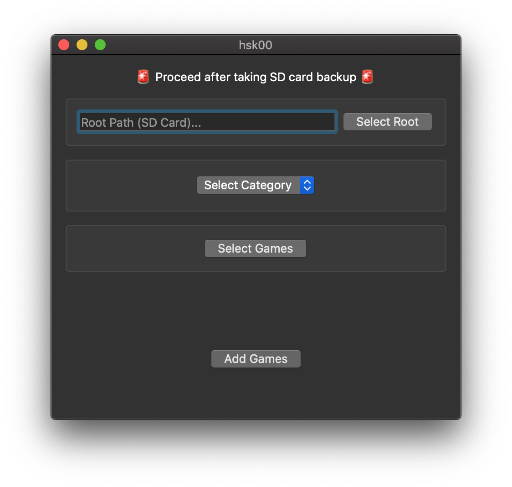
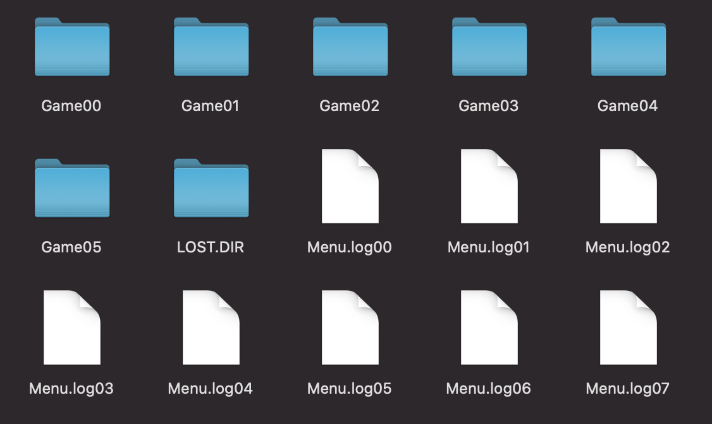

# 🚧 hsk00 🚧

Add/Replace games to your "Data Frog Y2 (568 in 1)" console.

<p align="center">

</p>

⚠️ Before you use this, backup your SD card. Just copy/paste all files to your computer.
<br />
<br />

## Download

There is no install step. You just download and run. GUI app will take some time to load (only on first launch)

- [Mac OS X GUI](https://github.com/dev-drprasad/hsk00/releases/download/latest/hsk-osx-gui.app.zip)
- Windows GUI (Not ready yet)
- Linux GUI (Not ready yet)
- [Mac OS X CLI](https://github.com/dev-drprasad/hsk00/releases/download/latest/hsk00-darwin-amd64)
- [Linux CLI](https://github.com/dev-drprasad/hsk00/releases/download/latest/hsk00-linux-amd64) (Should work with all popular distros)
- [Windows X CLI](https://github.com/dev-drprasad/hsk00/releases/download/latest/hsk00-windows-amd64.exe)

For CLI app, you need to give executable permission by running `chmod +x hsk00-darwin-amd64`

<br />

## CLI API

<br />

### `add`

Adds game(s) to given category (Racing, Adventure etc..)

`--category` number starts from `0`, left to right in menu. Example: "Racing Games" category number is `4`.

`--root` is root directory of game folder where `Menu.ocv` exists (can be sd card path or custom directory where files present)

**Example:**

```shell
hsk00-darwin-amd64 add nesroms/Famicom_Wars.nes  nesroms/Heavy_Barrel --category 4 --root ~/Datafrog
```

⚠️ This will change menu text slightly.

If you can't lanuch games or change page, restore files with your backup.

<br />

### `replace`

Replace will replace existing game with custom game.

Not implemented yet

<br />

### `descramble`

Converts `*.asd` files to usable `.zip` files. Output filename will be `<inputfilename>.zip` and will be generated in same directory where input file present.

Example:

```
hsk00-darwin-amd64 descramble  ~/Datafrog2/Game04/hsk06.asd
```

<br />

### `scramble`

Generates scrambled `asd` file given mutliple files. Input files can be anything. This is low level API. If you're uncertain what this command do, probably you don't need this command.

Example:

```
hsk00-darwin-amd64 scramble file1.nes file2.nes --out hskXX.asd
```

<br />

## Supported Consoles

- DATA FROG Y2 HD (568 in 1)
- Extreme Mini HD Game Box
- Probably works with console whose SD card looks like below

<p align="center">

</p>

Let me know if it works with other consoles. It helps other people

## TODO

- [ ] May be GUI ?
- [ ] replace game
- [ ] delete game

## Need Help

I am not able to understand what are `GameXX.bin`, `Menu.logXX` files. They have background images, and menu selection images hidden them. But I am not able to determine offset of these images. If you know anything about these files, please let me know.

## References

- http://bootleg.games/BGC_Forum/index.php?PHPSESSID=bvomlllrtphq11187kpvontr72&topic=1775.msg17586#msg17586
- https://golangcode.com/create-zip-files-in-go/
- https://gist.github.com/madevelopers/40b269730df687cdcb8b
- https://stackoverflow.com/questions/28513486/how-add-a-file-to-an-existing-zip-file-using-golang
- http://blog.ralch.com/tutorial/golang-working-with-zip/
- https://stackoverflow.com/a/42454716/6748719
- https://exifinfo.org/
