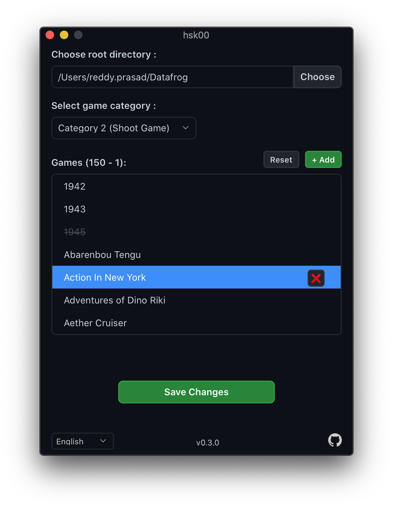

# 🚧 hsk00 🚧

Add/Replace games to your "Data Frog Y2 (568 in 1)" console.

<p align="center">

</p>

⚠️ Before you use this, backup your SD card. Just copy/paste all files to your computer.
<br />
<br />

## Download

There is no install step. You just download and run.

- [Mac OS X GUI](https://github.com/dev-drprasad/hsk00/releases/download/latest/hsk00-osx.dmg)
- [Windows GUI](https://github.com/dev-drprasad/hsk00/releases/download/latest/hsk00-windows.exe) (require windows7 SP1 or later)
- [Linux GUI](https://github.com/dev-drprasad/hsk00/releases/download/latest/hsk00-linux-gui.tar.gz) (Should work with all popular distros)

### Can't launch ?

**Windows 10 :**

If you're seeing "Microsoft Defender SmartScreen prevented an unrecognized app from starting", then click on "More Info" and then "Run anyway"

**OS X :**

if you're seeing "“hsk00” cannot be opened because the developer cannot be verified." message, then go to "System Preferences" -> "Security & Privacy", you see "hsk00 was blocked .....", click on "Open Anyway"

Feel free to create an [issue](https://github.com/dev-drprasad/hsk00/issues/new) if facing any issue other than the one specified above

<br />

## CLI

**Download CLI :**

- [Mac OS X CLI](https://github.com/dev-drprasad/hsk00/releases/download/latest/hsk00-osx-cli)
- [Linux CLI](https://github.com/dev-drprasad/hsk00/releases/download/latest/hsk00-linux-cli)
- [Windows CLI](https://github.com/dev-drprasad/hsk00/releases/download/latest/hsk00-windows-cli.exe)

For Linux and OS X binaries, you need to give executable permission by running command `chmod +x <filename>`.

<br />

### `add`

Adds game(s) to given category (Racing, Adventure etc..)

`--category` number starts from `0`, left to right in menu. Example: "Racing Games" category number is `4`.

`--root` is root directory of game folder where `Menu.ocv` exists (can be SD card path or custom directory where files present)

**Example:**

```shell
hsk00-darwin-amd64 add nesroms/Famicom_Wars.nes  nesroms/Heavy_Barrel --category 4 --root ~/Datafrog
```

⚠️ This will change menu text slightly and sorts games by alphabetical order

If you can't lanuch games or change page, restore files with your backup.

<br />

### `replace`

Replace will replace existing game with new game.

Not implemented yet

<br />

### `descramble`

Extracts hidden files from scrambled files. Output filename will be `<inputfilename>.<hidden-file-ext>` and will be generated in same directory where input file present. Can extract hidden zip files and image files

Example 1:

```
hsk00-darwin-amd64 descramble  ~/Datafrog2/Game04/hsk06.asd
```

Example 2:

```
hsk00-windows-cli.exe descramble  F:\Game04\Game01.bin --out F:\Game04\Page01-GameList.jpg
```

<br />

### `scrambled-zip`

Generates scrambled `asd` type files from given mutliple files. Input files can be anything. This is low level API. If you're uncertain what this command do, probably you don't need this command.

Example:

```
hsk00-darwin-amd64 scrambled-zip file1.nes file2.nes --out hskXX.asd
```

### `scramble`

This command is removed in favour of `scrambled-zip` from v0.2.0.

<br />

## Supported Consoles

- DATA FROG Y2 HD (568 in 1)
- Extreme Mini HD Game Box
- U-BOX EMX-041
- DEXP RetroGAME Flash + 300 игр
- Probably works with console whose SD card looks like below

<p align="center">

</p>

Let me know if it works with other consoles. It helps other people

## TODO

- [ ] replace game
- [ ] delete game

## Need Help

I am not able to understand what are `GameXX.bin`, `Menu.logXX` files. They have background images, and menu selection images hidden them. But I am not able to determine offset of these images. If you know anything about these files, please let me know.

## References

- http://bootleg.games/BGC_Forum/index.php?PHPSESSID=bvomlllrtphq11187kpvontr72&topic=1775.msg17586#msg17586
- https://golangcode.com/create-zip-files-in-go/
- https://gist.github.com/madevelopers/40b269730df687cdcb8b
- https://stackoverflow.com/questions/28513486/how-add-a-file-to-an-existing-zip-file-using-golang
- http://blog.ralch.com/tutorial/golang-working-with-zip/
- https://stackoverflow.com/a/42454716/6748719
- https://exifinfo.org/
